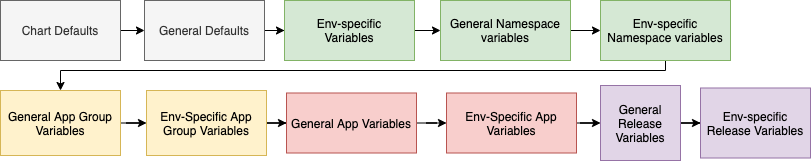

## Korgi Chart Organization - Sample Repository

This repository illustrates the chart organization framework used in [Korgi](https://github.com/DataReply/korgi). It is based on [helmfile](https://github.com/roboll/helmfile) and implements the following concepts.

- logical chart organization into namespaces, app groups, apps and releases
- multi-layer value organization to support DRY configuration management
- ability to use templating in release value definitions
- Support for local plus remote helm charts and arbitrary kubernetes config resources

### Namespaces, App Groups, Apps and Releases

Korgi organizes charts and their respective installations inside `realm/namespaces`. 
Namespaces are composed of app groups which in turn contain multiple apps. Apps are repsenseted by app files and reference one or many release definitions.
A release definition states the helm chart to install, while the installation instruction becomes complete with the instantiation of environment specific release values which managed under `realm/values`.
That being said, Korgi assumes that all these mentioned entities are present across environments and differences between environments will preferrably be configured inside the respective environment value directory.

 


The organization into namespaces, app groups and apps implemented inside this repository, is illustrated by the following tree view.
```
├── _defaults.yaml
├── layer-base (namespace)
│   ├── _namespace.yaml
│   ├── monitoring (app group)
│   │   ├── _app_group.yaml
│   │   └── prometheus.yaml (app file composed of multiple releases)
│   ├── network
│   │   ├── _app_group.yaml
│   │   ├── cni.yaml
│   │   └── ingress.yaml
│   ├── storage
│   │   ├── _app_group.yaml
│   │   ├── driver.yaml
│   │   └── volumes.yaml
│   └── system
│       ├── _app_group.yaml
│       ├── kyverno.yaml
│       └── scaling.yaml
└── layer-infra (namespace)
    ├── _namespace.yaml
    └── monitoring
        ├── _app_group.yaml
        ├── exporter.yaml
        ├── grafana.yaml
        └── prometheus.yaml

```


### Release Value and Secret Layering
Release values can be specified at different levels/layers 

(higher has precedence)
1. helm defaults specified alongside the helm chart (values.yaml file)
2. general defaults across environments
3. general defaults for a specific environment (e.g. defaults for the dev environment)
4. general namespace defaults across namespace (e.g. layer-infra both in dev and prod)
5. namespace default for a specific environment (e.g. layer-infra in prod only)
6. app group defaults across all environments (e.g. defaults for monitoring group both in dev and prod)
7. app group defaults for a specific environment (e.g. defaults for monitoring group in dev)
8. app defaults across all environments (e.g. defaults for prometheus app in both dev and prod)
9. app defaults for a specific environment (e.g. defaults for prometheus app in prod)
10. release defaults across all environments (e.g. defaults for cilium release in both dev and prod)
11. release defaults for a specific environment (e.g. defaults for cilium release in dev)
12. release defaults specified alongside the release in the app file




The tree view of values specified inside this repository is given by:

```
.
├── defaults
│   ├── layer-base
│   │   ├── monitoring
│   │   │   └── prometheus
│   │   │       └── prometheus-base.gotmpl
│   │   ├── network
│   │   │   └── ingress
│   │   │       └── ingress-examples.gotmpl
│   │   ├── storage
│   │   │   └── volumes
│   │   │       ├── values.gotmpl
│   │   │       └── values.yaml
│   │   └── system
│   │       └── kyverno
│   │           ├── kyverno-mutation-policies.gotmpl
│   │           └── kyverno.gotmpl
│   ├── layer-infra
│   │   ├── monitoring
│   │   │   ├── exporter
│   │   │   │   ├── aws-cloudwatch-exporter-sa.gotmpl
│   │   │   │   └── prometheus-blackbox-exporter.gotmpl
│   │   │   ├── grafana
│   │   │   │   ├── dashboards
│   │   │   │   │   ├── base
│   │   │   │   │   │   ├── external-dns.json
│   │   │   │   │   │   ├── keycloak.json
│   │   │   │   │   │   ├── kube-state-metrics.json
│   │   │   │   │   │   ├── loki.json
│   │   │   │   │   │   ├── prometheus-alerts-overview.json
│   │   │   │   │   │   └── rest-api-dashboard.json
│   │   │   │   │   └── gitlab-pipelines
│   │   │   │   │       ├── gitlab-ci-deployments.json
│   │   │   │   │       ├── gitlab-ci-jobs.json
│   │   │   │   │       └── gitlab-ci-pipelines.json
│   │   │   │   ├── grafana-resources.gotmpl
│   │   │   │   └── grafana.gotmpl
│   │   │   └── prometheus
│   │   │       ├── prometheus-base.yaml
│   │   │       ├── prometheus-pushgateway.gotmpl
│   │   │       ├── prometheus.gotmpl
│   │   │       ├── thanos.gotmpl
│   │   │       └── values.gotmpl
│   │   └── values.yaml
│   ├── secrets.yaml
│   ├── values.gotmpl
│   └── values.yaml
└── env
    ├── client-dev
    │   ├── layer-infra
    │   │   ├── monitoring
    │   │   │   ├── grafana
    │   │   │   │   ├── grafana.yaml
    │   │   │   │   └── secrets.yaml
    │   │   │   └── prometheus
    │   │   │       ├── prometheus-apps.yaml
    │   │   │       ├── prometheus-base.yaml
    │   │   │       ├── prometheus-data.yaml
    │   │   │       ├── prometheus-infra.yaml
    │   │   │       ├── prometheus-interfaces.yaml
    │   │   │       ├── prometheus.yaml
    │   │   │       └── thanos.yaml
    │   │   └── values.yaml
    │   ├── secrets.yaml
    │   └── values.yaml
    ├── client-prod
    │   ├── layer-infra
    │   │   ├── monitoring
    │   │   │   ├── exporter
    │   │   │   │   ├── pipelines-exporter.gotmpl
    │   │   │   │   ├── pipelines-exporter.secrets.yaml
    │   │   │   │   └── values.yaml
    │   │   │   ├── grafana
    │   │   │   │   ├── grafana.yaml
    │   │   │   │   ├── secrets.yaml
    │   │   │   │   └── secrets.yaml.dec
    │   │   │   └── prometheus
    │   │   │       ├── prometheus-apps.yaml
    │   │   │       ├── prometheus-base.yaml
    │   │   │       ├── prometheus-data.yaml
    │   │   │       ├── prometheus-infra.yaml
    │   │   │       ├── prometheus-interfaces.yaml
    │   │   │       ├── prometheus.yaml
    │   │   │       └── thanos.yaml
    │   │   └── values.yaml
    │   ├── secrets.yaml
    │   ├── values.gotmpl
    │   └── values.yaml
    └── migration-dev
        ├── layer-base
        │   └── monitoring
        │       └── exporters
        ├── values.gotmpl
        └── values.yaml

```

### Test this repository

sops updatekeys secrets.yaml

2. Import the gpg key pair located in `doc/keys`
```
gpg --import ./doc/keys/public
gpg --allow-secret-key-import --import  ./doc/keys/private.key
```